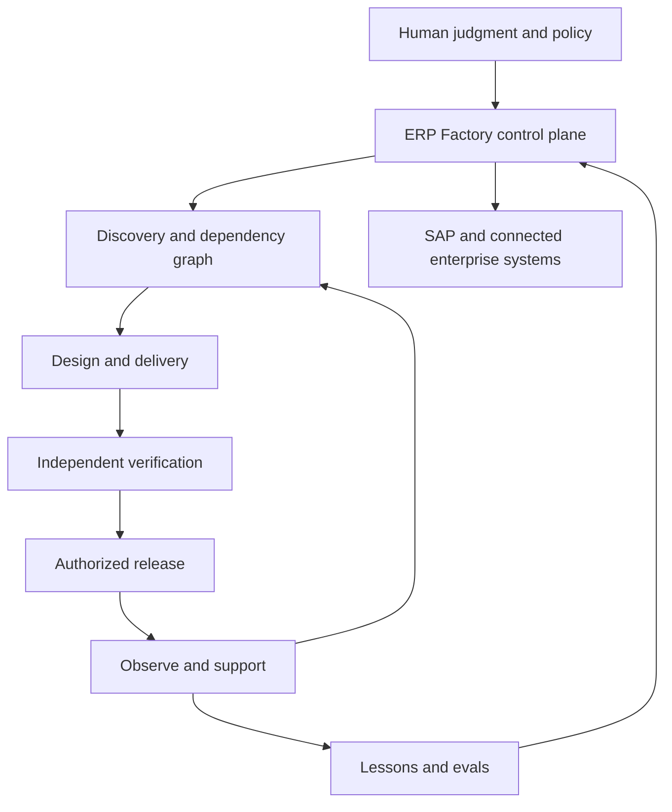
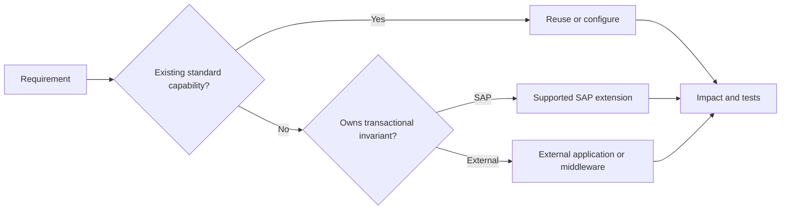
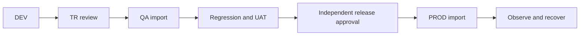
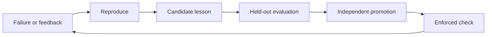
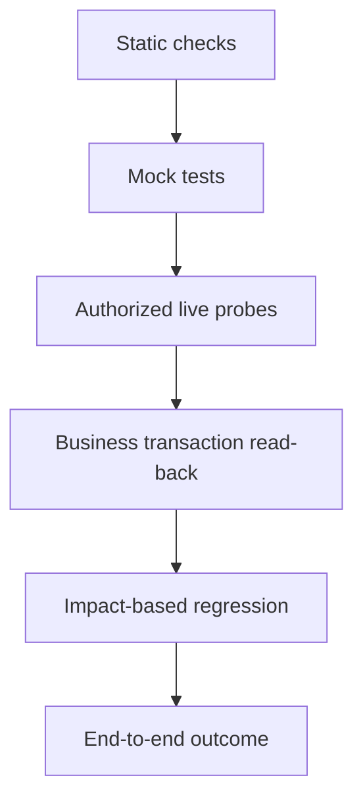

# Visual atlas
GitHub renders these Mermaid diagrams in Markdown.

```mermaid
flowchart TD
 H[Human judgment and policy] --> C[ERP Factory control plane]
 C --> D[Discovery and dependency graph]
 D --> W[Design and delivery]
 W --> V[Independent verification]
 V --> R[Authorized release]
 R --> O[Observe and support]
 O --> D
 O --> L[Lessons and evals]
 L --> C
 C --> S[SAP and connected enterprise systems]
```

```mermaid
flowchart LR
 A[Requirement] --> B{Existing standard capability?}
 B -->|Yes| C[Reuse or configure]
 B -->|No| D{Owns transactional invariant?}
 D -->|SAP| E[Supported SAP extension]
 D -->|External| F[External application or middleware]
 C --> G[Impact and tests]
 E --> G
 F --> G
```

```mermaid
flowchart LR
 A[DEV] --> B[TR review]
 B --> C[QA import]
 C --> D[Regression and UAT]
 D --> E[Independent release approval]
 E --> F[PROD import]
 F --> G[Observe and recover]
```

```mermaid
flowchart LR
 A[Failure or feedback] --> B[Reproduce]
 B --> C[Candidate lesson]
 C --> D[Held-out evaluation]
 D --> E[Independent promotion]
 E --> F[Enforced check]
 F --> A
```

```mermaid
flowchart TD
 A[Static checks] --> B[Mock tests]
 B --> C[Authorized live probes]
 C --> D[Business transaction read-back]
 D --> E[Impact-based regression]
 E --> F[End-to-end outcome]
```
